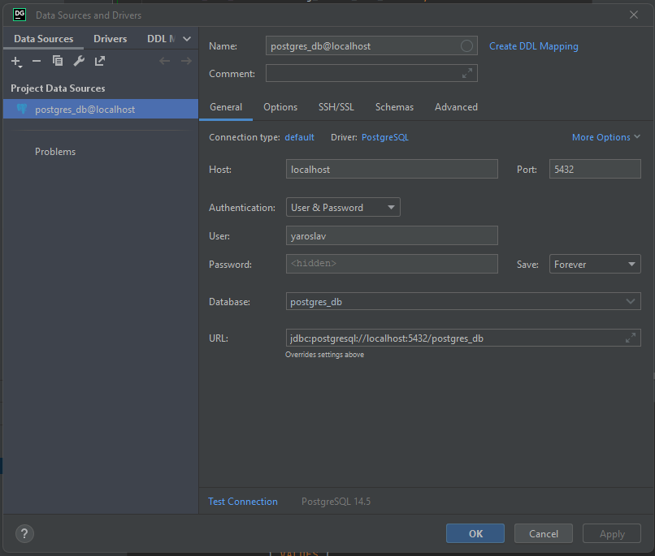

# Синхронизация данных с Google-таблицой в качестве источника 

Скрипт python отслеживает изменения в таблице-источнике и заносит изменения в БД PostreSQL.
Некоторые поля модифицируются, добавляются новые.
Просмотр текущего состояния скопированной в БД таблицы осуществляется через web-клиент.

- порядковый номер - число
- индекс заказа - число
- стоимость товаров в долларах США
- дата поставки - дата в российском формате даты

Нужно взять значение курса пары RUB-USD с сайта ЦБ РФ на сегодня, скопировать таблицу с облака и перенести в БД PostreSQL, добавив колонку "стоимость в  руб.". После этого нужно отслеживать изменения и периодически обновлять таблицу.

## Технические требования:
- OS Windows 10 / Linux (Код кроссплатформенный, но на Linux не тестировал установку)
- python 3.9+
- JetBrains DataGrid
- PostgreSQL 14+
- модули python из [requirements.txt](./requirements.txt)
- Необязательно: Docker 20.10.8


## Настройка:
1. Зарегистировать service account Google по [гайду](https://habr.com/ru/post/483302/) (до параграфа про sheetID).
2. Переметить credentials в папку secret/ в файл [secret/credentials.json](./secret/credentials.json)
3. Удалите [secret/gsheets_cached_config.json](./secret/gsheets_cached_config.json), чтобы использовать свою копию таблицы. В этом случае будет создана новая копия [исходной таблицы](https://docs.google.com/spreadsheets/d/1LTejK-Oo7L1bFreBIIcEZnF1W1RCC1s_jos3EuIP0jI) на диске сервис-аккаунта из [secret/credentials.json](./secret/credentials.json) на аккаунты, описанные в [WorkerScript/lib/config.py .EMAIL_ADDRS](./WorkerScript/lib/config.py). В консоль выводится ссылка на таблицу. Сама копия лежит во втором листе.
4. Проверить доступ (credentials) можно, запустив скрипт [./secret/test_service_account.py](./secret/test_service_account.py).
Если успешно, в консоли выведутся 2 колонки тестовой таблицы.
5. создать в папке secret/ файл [db.json](./secret/db.json) вида (значения заменить на актуальные):
```json
{
  "DB_NAME": "postgres_db",
  "USER": "yaroslav",
  "PSWD": "20031956",
  "HOST": "localhost"
}
```

6. Заглянуть в [WorkerScript/lib/config.py](./script/lib/config.py) за дополнительными настройками
7. Заглянуть в [Server/_Main/settings.py](./Server/_Main//settings.py) за дополнительными настройками сервера. CHUNK_SIZE определяет максимальное число строк, отдаваемое на клиент за раз. GSHEET_CONFIG_FILE_DIR нужно поменять, если поменялось местоположение конфига [secret/gsheets_cached_config.json](./secret/gsheets_cached_config.json). Аналогично для [DATABASE_CONFIG_FILE] - путь до [./db.json](./secret/db.json).
8. Для запуска в **докере** нужно установить "HOST": "host.docker.internal" в [./db.json](./secret/db.json), и IP адрес для сервера: **"host.docker.internal:8080"** либо использовать иную сеть.


## Запуск приложения:
  *Заметки*

  В Linux интерпретатор питона именуется __python3__, а в Windows - *__py__*.
  В Linux команды в гайде по установке выполнять с префиксом ```sudo```.
  В Linux через стандартные менеджеры ставится неакутальная версия node. [Помощь с обновлением ниже](#tip-node).
  В Windows виртуальная среда python активируется командой: ```./venv/Scripts/activate```.
  В Windows модули python, так же как и в Linux, ставятся с помощью утилиты ```pip```, но необходим префикс ```py -m pip ...```.


  *Инициализация БД*

1. ```psql -U postgres  # Linux``` [Путь до .exe](#tip-psql)
2. ```bash
   CREATE USER yaroslav WITH password '20031956';
   CREATE DATABASE postgres_db OWNER yaroslav;
   # Возможно, потребуется выдать привелегии:
   GRANT ALL PRIVILEGES ON DATABASE postgres_db TO yaroslav;
   ```

  *Заполние базы*

3. Создать пустой проект и подключиться к БД через DataGrib

    

4. Выполнить скрипт, скопированный из [initdb.sql](./db/initdb.sql), в **консоли DataGrip**.


+ Запуск системы в "ручном режиме"
    - *Запуск основного скрипта*
    1. ```py -m venv venv```
    2. ```py -m pip install -r requirements```
    3. ```py .\WorkerScript\main.py  # запуск из корня проекта!```


    - *Сборка и запуск веб-клиента*
    1. ```cd WebClient```
    2. ```npm i```
    3. ```npm start```


    - *Сборка и запуск веб-сервера*
    1. ```py -m venv venv```
    2. ```py -m pip install -r requirements```
    3. ```cd Server``` 
    4. ```py manage.py collectstatic``` 
    5. ```py manage.py inspectdb  # если были изменения в исходном скрипте создания БД``` 
    6. ```py manage.py runserver 8080``` 


+ Запуск системы "одной командой"

    - *Скрипт под Windows 10*
    1. ```npm i```
    2. ```npm start```

    - *Скрипт под Linux Ubuntu 20.04. Запуск только сервера API и веб-клиента. Запуск скрипта Worker.py производить в отдельном терминале*
    1. ```sudo apt install tmux```
    2. ```sudo npm i```
    3. ```sudo npm start-linux```


+ Запуск в Докере. Работает точно так же: после длительного ожидания запускается сервер статики, тогда можно проверить в браузере: по умолчанию [localhost:3000](http://localhost:3000). 

 ```docker build --tag google-sheet-referer-local .```
    
    

## Автор
- [Лошкарев Ярослав](https://github.com/94R1K)
